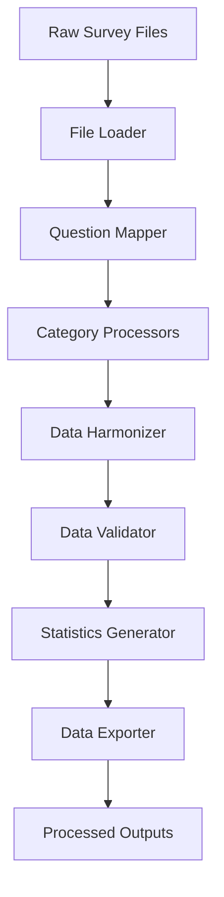

# State of Open Data - Comprehensive Data Processing Pipeline

A comprehensive React TypeScript application with advanced data processing capabilities for analyzing 10+ years of State of Open Data survey data (2014-2024).

## 🌟 Features

### React Application
- **Modern React with TypeScript** - Type-safe development with latest React features
- **Tailwind CSS** - Responsive, utility-first styling
- **Redux Toolkit** - Predictable state management
- **React Router** - Client-side routing for multi-page navigation
- **Recharts** - Interactive data visualizations
- **Responsive Design** - Mobile-friendly interface

### Data Processing Pipeline
- **Multi-format Support** - Excel (.xlsx), CSV, and text files
- **Question Harmonization** - Maps equivalent questions across survey years
- **Data Standardization** - Normalizes response formats and demographic categories
- **Missing Data Handling** - Intelligent imputation strategies
- **Data Validation** - Comprehensive integrity checks
- **Statistical Analysis** - Automated generation of summary statistics

### Core Analysis Categories
- **Researcher Demographics** - Age, gender, country, discipline, job title, career stage
- **Attitudes to Open Science** - Open access, open data, open peer review, preprints
- **Data Sharing Motivations** - Reproducibility, collaboration, transparency, mandates
- **Barriers to Sharing** - Time constraints, privacy, competition, technical challenges
- **FAIR Principles Awareness** - Findable, Accessible, Interoperable, Reusable
- **Institutional Support** - Policies, mandates, training, funding, infrastructure

## 🚀 Quick Start

### Prerequisites
- Node.js 18+ 
- npm or yarn

### Installation
```bash
# Clone and install dependencies
npm install

# Start development server
npm run dev
```

### Running the Data Processing Pipeline
```bash
# Build the application
npm run build

# Run the data processing pipeline
npm run process-data
```

## 📁 Project Structure

```
sood/
├── src/
│   ├── components/          # React components
│   │   ├── Layout.tsx       # Main layout with navigation
│   │   └── DataInventory.tsx # Data overview component
│   ├── pages/               # Route pages
│   │   ├── Dashboard.tsx    # Main dashboard
│   │   ├── Trends.tsx       # Time series analysis
│   │   ├── Comparisons.tsx  # Year-over-year comparisons
│   │   └── DeepDive.tsx     # Detailed data exploration
│   ├── pipeline/            # Data processing pipeline
│   │   ├── DataProcessor.ts # Main processing orchestrator
│   │   ├── QuestionMapper.ts # Cross-year question mapping
│   │   ├── processors/      # Category-specific processors
│   │   ├── harmonizers/     # Data standardization
│   │   ├── validators/      # Data quality validation
│   │   └── exporters/       # Output generation
│   ├── store/               # Redux store configuration
│   ├── types/               # TypeScript type definitions
│   └── utils/               # Utility functions
├── public/                  # Static assets
└── output/                  # Generated processed data
```

## 🔄 Data Processing Pipeline

### Pipeline Architecture



### Processing Steps

1. **File Loading** - Reads Excel, CSV, and text files from survey years
2. **Question Mapping** - Creates cross-year mappings for equivalent questions
3. **Category Processing** - Extracts and standardizes data by category
4. **Data Harmonization** - Normalizes formats and handles missing data
5. **Validation** - Performs quality checks and generates warnings
6. **Statistics** - Calculates comprehensive summary statistics
7. **Export** - Generates CSV, JSON, and markdown outputs

### Question Harmonization

The pipeline includes sophisticated question mapping to handle survey evolution:

```typescript
// Example: Attitude questions mapped across years
{
  id: 'attitude_open_access',
  category: 'attitudes',
  question: 'Attitudes towards open access',
  mappings: {
    2021: ['How do you feel about open access to research publications?'],
    2022: ['How do you feel about open access to research publications?'],
    2023: ['How do you feel about open access to research publications?'],
    2024: ['How do you feel about open access to research publications?']
  }
}
```

## 📊 Data Outputs

### Generated Files

- **`sood_processed_complete.csv`** - Full harmonized dataset
- **`sood_processed_complete.json`** - Complete dataset with metadata
- **`sood_summary_statistics.json`** - Statistical summaries
- **`sood_validation_report.md`** - Data quality assessment
- **`sood_YYYY_processed.csv`** - Individual year datasets

### Data Schema

#### Demographics
- Age groups (standardized: 18-24, 25-34, 35-44, 45-54, 55-64, 65+)
- Gender (Male, Female, Non-binary, Other, Prefer not to say)
- Country (standardized country names)
- Discipline (mapped to major categories)
- Job title (standardized academic/industry roles)
- Career stage (Early Career, Mid Career, Senior)

#### Attitudes (1-5 Likert scale)
- Open access to publications
- Open data sharing
- Open peer review
- Preprints
- General open science
- Data sharing practices

#### Motivations (1-5 importance scale)
- Reproducibility
- Collaboration
- Transparency
- Mandate compliance
- Increased citations
- Personal values
- Community expectations

#### Barriers (1-5 severity scale)
- Time constraints
- Privacy concerns
- Competitive advantage
- Lack of incentives
- Technical challenges
- Lack of training
- Intellectual property
- Institutional policy

#### FAIR Awareness (1-5 familiarity scale)
- Overall FAIR principles awareness
- Findable principle understanding
- Accessible principle understanding
- Interoperable principle understanding
- Reusable principle understanding
- Implementation frequency

#### Institutional Support (boolean)
- Data policy exists
- Sharing mandate exists
- Training provided
- Support staff available
- Funding support
- Repository access

## 🔍 Data Quality Features

### Missing Data Handling
- **Demographics**: Preserved as null for analysis
- **Attitudes/Motivations/Barriers**: Median imputation for Likert scales
- **FAIR Awareness**: Preserved as null (explicit knowledge)
- **Institutional Support**: Mode imputation for boolean values

### Validation Checks
- Range validation for numeric scales (1-5)
- Type validation for all fields
- Completeness scoring per response
- Cross-year consistency checks
- Outlier detection for numeric fields

### Quality Metrics
- **Completeness Score**: Percentage of non-null fields
- **Missing Data Rate**: Percentage of invalid responses
- **Field Coverage**: Response rates per question
- **Yearly Comparisons**: Data quality trends over time

## 📈 Statistical Outputs

### Summary Statistics
- Response counts by year and demographic
- Mean scores for all attitude/motivation/barrier scales
- Distribution analyses for categorical variables
- Trend analyses across survey years

### Key Metrics
- Overall attitude towards open science
- Top motivations for data sharing
- Most significant barriers to sharing
- FAIR principles maturity levels
- Institutional support coverage

## 🔧 Configuration

### Pipeline Configuration
```typescript
// Customize missing data strategies
const missingDataStrategies = {
  'demographics': 'preserve',
  'attitudes': 'median_impute',
  'motivations': 'median_impute',
  'barriers': 'median_impute',
  'fair': 'preserve',
  'institutional': 'mode_impute'
};
```

### Question Mapping
Add new question mappings in `src/pipeline/QuestionMapper.ts`:
```typescript
this.addMapping({
  id: 'new_question_id',
  category: 'category_name',
  subcategory: 'subcategory',
  question: 'Question text',
  responseType: 'likert',
  mappings: {
    2024: ['Column name in 2024 data'],
    2025: ['Column name in 2025 data']
  }
});
```

## 🧪 Usage Examples

### Basic Pipeline Execution
```typescript
import { processStateOfOpenDataSurvey } from './src/pipeline';

await processStateOfOpenDataSurvey(
  '/path/to/survey/files',
  './output/processed'
);
```

### Custom Processing
```typescript
import { DataProcessor, DataExporter } from './src/pipeline';

const processor = new DataProcessor();
const dataset = await processor.processDirectory('/data/path');

const exporter = new DataExporter();
await exporter.exportToCSV(dataset, 'custom_output.csv');
```

### React Integration
```typescript
import { DataInventory } from './src/components/DataInventory';

function App() {
  return (
    <div>
      <DataInventory />
      {/* Other components */}
    </div>
  );
}
```

## 📋 Data Sources

### Supported File Formats
- **Excel** (.xlsx) - Primary format for most survey years
- **CSV/TSV** (.csv, .txt) - Tab-delimited text files
- **Documentation** (.docx) - Survey questionnaires and methodologies

### Expected Directory Structure
```
State of Open Data 10 Years/
├── FINALOpenData2017anonrawdata20171110 (1).xlsx
├── State of Open Data 2018_August 7, 2018_11 22 (1).xlsx
├── SoOD_2019_rawdata_anon_FIGSHARE SHARED (1).txt
├── State of Open Data 2021_Master data_cleaned (1).xlsx
├── State of Open Data 2022_data to share (1).xlsx
├── Springer Nature_SOOD_clean_anonymised_data_2023_V1.xlsx
├── State of Open Data 2024 - Data.xlsx
└── [questionnaire files].docx
```

## 🛠️ Development

### Available Scripts
```bash
npm run dev          # Start development server
npm run build        # Build for production
npm run preview      # Preview production build
npm run lint         # Run ESLint
npm run typecheck    # Run TypeScript checks
npm run process-data # Run data processing pipeline
```

### Adding New Processors
1. Create processor in `src/pipeline/processors/`
2. Implement the required interface
3. Add to main `DataProcessor.ts`
4. Update types in `src/pipeline/types.ts`

### Extending Question Mappings
1. Analyze new survey data structure
2. Add mappings to `QuestionMapper.ts`
3. Update processor logic if needed
4. Test with validation pipeline

## 📚 Technical Details

### Dependencies
- **React 18** - Latest React with concurrent features
- **TypeScript 5** - Strong typing and latest language features
- **Vite** - Fast build tool and development server
- **Tailwind CSS 3** - Utility-first CSS framework
- **Redux Toolkit** - Modern Redux with RTK Query
- **SheetJS** - Excel file parsing and manipulation
- **Recharts** - React charting library

### Performance Considerations
- Streaming data processing for large files
- Efficient memory usage with chunked processing
- Optimized React rendering with useMemo/useCallback
- Bundle size optimization with tree shaking

### Browser Support
- Modern browsers with ES2020+ support
- Chrome 88+, Firefox 85+, Safari 14+
- Mobile browsers on iOS 14+ and Android 10+

## 🤝 Contributing

1. Fork the repository
2. Create a feature branch: `git checkout -b feature/new-feature`
3. Make your changes and add tests
4. Ensure all tests pass: `npm test`
5. Submit a pull request

### Code Style
- Use TypeScript for all new code
- Follow ESLint configuration
- Write comprehensive tests for new features
- Document complex algorithms and data transformations

## 📄 License

This project is licensed under the MIT License. See the LICENSE file for details.

## 🙏 Acknowledgments

- State of Open Data survey team for providing comprehensive datasets
- Digital Science and Springer Nature for survey coordination
- Research community for participation in surveys over 10+ years

---

For questions or support, please open an issue in the GitHub repository.